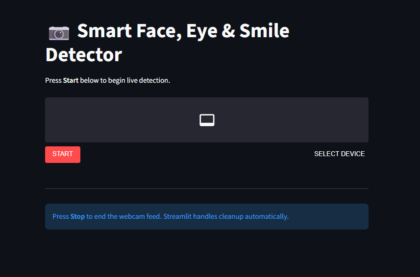
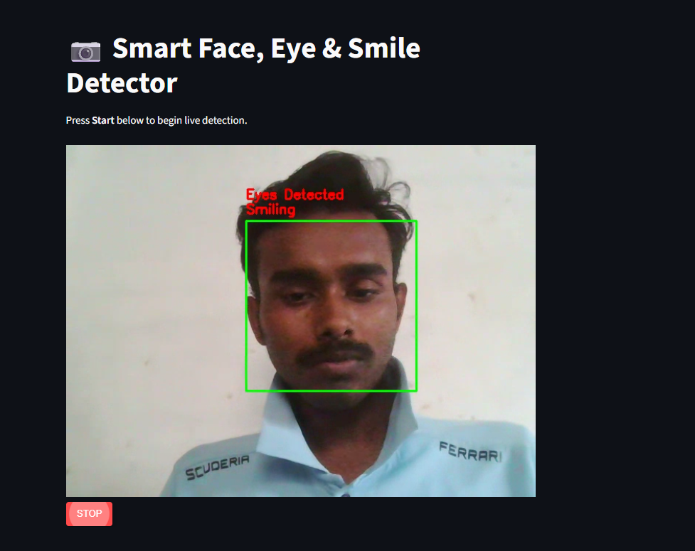
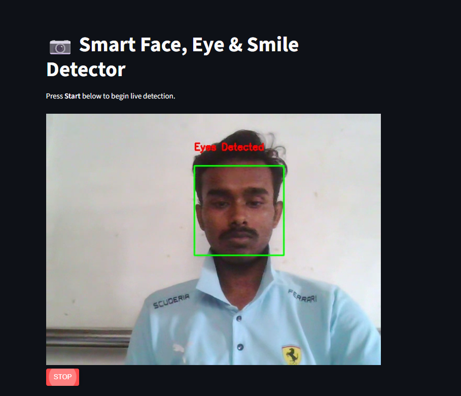

# 📷 Smart Face, Eye & Smile Detector

Welcome to the **Smart Face, Eye & Smile Detector**! 🎉  
This is a real-time web application that detects **faces**, **eyes**, and **smiles** using your webcam. Built with **Streamlit**, **OpenCV**, and **WebRTC**, it’s fast, interactive, and fun! 😄

---

## 🚀 Features

- 🧑‍🤝‍🧑 **Face Detection**: Detect multiple faces in real-time.  
- 👀 **Eye Detection**: Recognizes eyes within detected faces.  
- 😁 **Smile Detection**: Detects smiles and shows a message.  
- 🎥 **Live Webcam Feed**: Stream your camera directly in the browser.  
- ✨ **Interactive UI**: Easy to use with start/stop controls.  

---

## 💻 Demo

  

---

  

---

  

---

## 🛠️ Installation

1. **Clone the repository**

```bash
git clone https://github.com/yourusername/smart-face-detector.git
cd smart-face-detector
````

2. **Create a virtual environment (optional but recommended)**

```bash
python -m venv venv
source venv/bin/activate   # Linux / Mac
venv\Scripts\activate      # Windows
```

3. **Install dependencies**

```bash
pip install -r requirements.txt
```

---

## 🚀 Run the App

```bash
streamlit run app.py
```

* Press **Start** to begin live detection.
* Press **Stop** to end the webcam feed. Streamlit handles cleanup automatically.

---

## 📦 Dependencies

* `streamlit` 🌐
* `opencv-python-headless` 🖼️
* `streamlit-webrtc` 📹
* `av` 🔄
* `numpy` 🔢

---

## 📝 Notes

* Make sure your browser has **webcam access** enabled.
* Works best with **good lighting conditions**.
* Tested on **Python 3.10+**.

---

## ⭐ Support
If you found this repository helpful, don’t forget to star ⭐ the repo.
Your support motivates me to learn and share more! 💡

---

## ⚡ License

This project is **MIT Licensed**.

---
